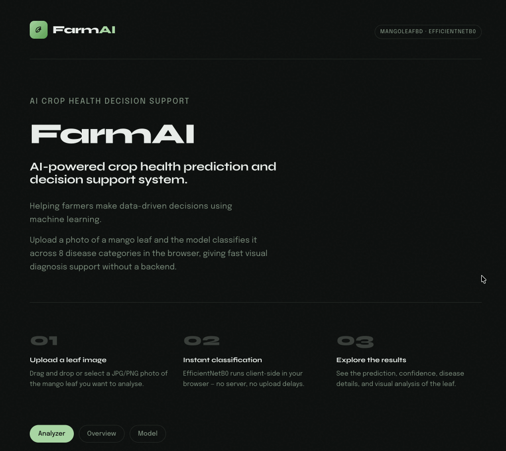

# FarmAI

FarmAI is a static mango leaf disease classifier that runs entirely in the browser with TensorFlow.js, so it can be deployed to GitHub Pages without Flask, Streamlit, Firebase, or any other backend.

**Demo:** 
<p align="center">
  
</p>
---

## Repo layout

- `index.html`, `css/`, `js/`: the static website
- `model/`: generated TensorFlow.js browser model files for GitHub Pages
- `Development/train_model.py`: retrains or fine-tunes the Keras model using `Dataset/`
- `Development/export_tfjs.py`: exports a trained Keras model into `model/model.json`
- `Development/artifacts/mango_leaf_disease.keras`: the latest local training artifact
- `Dataset/`: local training data only, not needed for deployment

## Local training setup

Create a Python 3.11 or 3.12 virtual environment, then install the training/export dependencies:

```bash
python3.11 -m venv .venv
source .venv/bin/activate
pip install -r requirements.txt
```

The repo is pinned to a tested TensorFlow / TF-Keras / TensorFlow.js export stack. The default training workflow uses the balanced `Dataset/` folder in this repo and continues from `Development/artifacts/mango_leaf_disease.keras` when that artifact is present.

## Retrain the model

From the project root:

```bash
python Development/train_model.py
```

Useful options:

- `--resume-model none` to start from a fresh EfficientNetB0 backbone
- `--epochs 20 --fine-tune-epochs 8` for a longer run
- `--base-weights none` if you need a fully offline fresh start

Training outputs are written to `Development/artifacts/`:

- `mango_leaf_disease.keras`
- `training_history.json`
- `evaluation.json`
- `dataset_splits.json`

## Export the browser model

After training, export the TensorFlow.js files that the website needs:

```bash
python Development/export_tfjs.py
```

The export script uses the TensorFlow.js Keras converter modules directly instead of the package's higher-level import path, because the direct converter path is stable in this repo's pinned environment.

This writes:

- `model/model.json`
- `model/group*-shard*`
- `model/metadata.json`

## Deploy to GitHub Pages

Only the static app needs to be published:

- `index.html`
- `css/`
- `js/`
- `model/`

The `Dataset/` folder and `Development/` training files are local-only and do not need to be deployed.

Then in GitHub:

1. Push the repo.
2. Open `Settings` > `Pages`.
3. Set the source to deploy from the repository root on your chosen branch.
4. Wait for the site to publish.

Because the app uses relative asset paths, it can run directly on GitHub Pages once the exported `model/` files are present.
